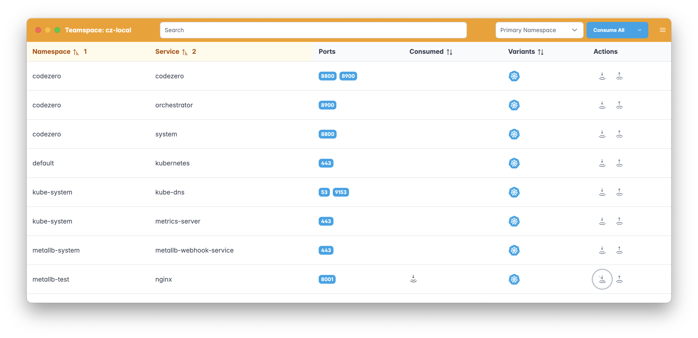

# Codezero - K3D - MetalLB

This is the process for setting up a local k3d cluster, adding MetalLB and using Codezero from the local host.
NOTE: This will only be useful for solo, local development. Collaboration via a Codezero Teamspace is not possible with a locally running k3d cluster.

## Create K3D Cluster

```
k3d cluster create cz-local --api-port 6550 \
--port 8800:8800@loadbalancer \
--port 8900:8900@loadbalancer \
--port 8001:8001@loadbalancer \
--k3s-arg "--disable=traefik@server:0" \
--agents 2
```
Note: The above command exposes the codezero ports, 8800 and 8900, to the host machine.  The mapping
of 8001 is just for the metallb test.

## Install and Configure MetalLB

```
kubectl apply -f https://raw.githubusercontent.com/metallb/metallb/v0.14.5/config/manifests/metallb-native.yaml
```

Wait for metallb to be running

```
kubectl get pods -n metallb-system
```

Run "ips.sh" script to add IP addresses (127.10.0.100 through 127.10.0.109) to the loopback device

```
sudo ./ips.sh
```

Verify that they are added:

```
ifconfig lo0
```

Run the following to add IP addresses (127.10.0.100 through 127.10.0.109) to metallb

```
kubectl apply -f metallb.yaml
```

Test metallb

```
kubectl create namespace metallb-test
kubectl create deploy nginx --image nginx:latest -n metallb-test
kubectl expose deploy nginx --port 8001 --target-port=80 --type LoadBalancer -n metallb-test
```

```
kubectl get all -n metallb-test
```

```
curl <ip of the svc>:8001
```

## Install Codezero

Visit the Codezero HUB and follow the directions on screen.  Detailed instructions are here: https://docs.codezero.io/guides/teamspace-setup. Use the k3d cluster you just created for the install.
```
hub.codezero.io
```

## Using Codezero

Consume the nginx service in the metallb-test namespace.  



Then access it via curl:

```
curl http://nginx.metallb-test:8001
```

## Support

If you have any further questions - please connect via Discord: https://discord.gg/wx3JkVjTPy, or support@codezero.io or your dedicated Slack Connect channel if you're an Enterprise Customer.
